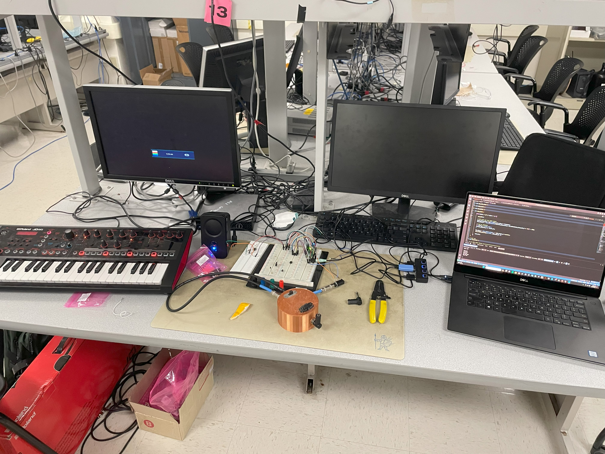

# Welcome to Pelham Bergesen's ECE 4760 final project page!

## Project Introduction

ECE 4760 is a microcontrollers class, so the standard platform we use for all our projects is the Raspberry Pi Pico. We code in C and use different hardware peripherals to make our microcontroller perform different functions, such as emulating birdsong and implementing PID control. For my final project, I drew on a couple functions we had worked on earlier in the year, specifically analog-to-digital conversion, direct digital synthesis, and PWM signal generation.

My project was turning my Raspberry Pi Pico microcontroller into a synthesizer, controlled by a MIDI keyboard output (MIDI is a method of containing and transmitting musical information from controllers to instruments). This MIDI control was inputted into the Pico via a UART channel, where the Pico then read the bytes transmitted in the MIDI message and decoded which frequency to output. This frequency was generated via PWM, so my final output sound was a square wave, resulting in a classic synth sound.

My project setup is pictured below, with the controller on the left, the synth (Pico) in the middle, and my computer on the right reading the serial output from the Pico.

## High Level Design

The source of my project idea was actually my MIDI controller itself, the Roland JD-XI. While I used it only as a MIDI controller for my project, this keyboard has a lot of the functionality I considered implementing for my final project, such as the ability to swap between square, sine, triangle, and sawtooth waves. The JD-XI also has an effects chain, toggleable from the keyboard itself, with potentiometers to determine the amount of effect that is applied to the output sound. A picture of the JD-XI is below.

The background math present in my project mostly relates to the notes on a piano. These are established frequencies, so I didn’t have to do any of these calculations myself, but essentially the notes on my keyboard are divided into the same frequencies as the notes on a standard-tuned piano. These frequencies are based on the note “A” having a fundamental frequency of 440 Hertz, moving up by a factor of 2 for the next higher A note for 880 Hz. The notes in between the octaves of A are then divided between these frequencies according to a logarithmic function and increase by a factor of the square root of twelve. As I mentioned previously, I did not do any of these calculations as these are established frequencies, and I just hard-coded the frequencies for my keys into the program I wrote. 

The structure of the program is pretty simple: my keyboard outputs MIDI, which is read into the Raspberry Pi and then parsed based on the notes’ unique encoding. Then, once the note has been identified, the Pico generates a PWM frequency based on that note.

The issue of latency is pretty prevalent in more musical engineering applications, so I had to ensure that the code parsing the notes would not take too long to execute. Additionally, whatever wave-generation function I used, which would have been more of a concern with DDS, would have to meet timing constraints as well or risk not producing the proper frequency.

As far as I am concerned, my design did not violate any patents or copyrights, but admittedly I was trying to emulate some functions of the previously mentioned JD-XI synthesizer by Roland.

## Program and Hardware Design

The most infuriating part of my program design was decoding the MIDI outputs from my controller. This journey started with strange diagrams from the internet, telling me that I only needed to tap into two of the five prongs on the MIDI cable, as shown in the picture below.

Once I tapped into this cable, I was able to see the signals coming from the MIDI controller. They looked like this when viewing them on the oscilloscope:

I noticed that these signals were too high in voltage to be read by my Pico’s UART interface, so I dropped the signal’s voltage by using two diodes in series. This brought the signal back down to a level that could be safely read by the Pico. I then wrote code that would read the incoming signals via this UART channel and output them to my serial monitor. 

Upon inspecting this output, I determined that the signals I was receiving were reliable and could be used to identify which note was pressed. For example, the signature 3-byte sequence for the lowest C note on my keyboard was (115 59 0), the lowest D was (51 59 0), and the lowest E was (243 59 0). However, if you've noticed the pattern between these three numbers, you're more perceptive than I was at first glance, and you might even be able to guess some of the issues I would later encounter. It appears that the first byte goes up by 32 per note, so moving from C to C# to D, the byte value moves from 115 to 51. This pattern continues as the notes increases, until the value reaches zero, at which point it wraps back up to 256 and continues decreasing. The second byte displays a similar macro-pattern, where in the first octave of notes has a second byte of 59 and the second octave and up has a second byte of 118.

These patterns, however convenient, cause an overlap issue between many notes on the keyboard. I thought I could find some sort of difference in the way my UART decoded the different note-on signature messages, but it became clear that they were present in many places across my keyboard. To try and mitigate this damage, I used only the white notes (for the key of C), which avoided overlapping for two octaves until I reached the third C. This note had the same signature pattern as a lower D note, so I stopped here to re-evaluate how my UART was configured. This limited the number of keys I was able to code successfully.

One possible source of the issue is the way I was routing the MIDI to UART. As you can tell from the oscilloscope picture, the MIDI notes appear to be active low; I later learned, after I had done all my note-decoding, that the UART protocol is active high. This could have led to my signals being corrupt or registered incorrectly, which would line up with the fact that none of the signals appeared to follow standard MIDI protocol, which usually would have a status byte (defining if the signal is a Note On signal, a Note Off signal, or another type of MIDI signal) before any byte containing information about the actual note. However, I'm still skeptical of this conclusion, since it seems to me that even if the highs and lows were reversed, I would not be seeing signals that followed standard MIDI protocol (see [reference 1](appendixb.md)). For whatever reason, my setup was pretty exact, and I can't say if a different MIDI output would produce different results on a UART level, but I would hope that a more reliable transmission method could be identified, given more time and effort. Either way, the inputs I was able to code were reliably read by my Pico, so I had two octaves of notes to play with at least.

Notes that I left un-coded were not handled by any particular "if" statement, so their output was pretty funny and non-deterministic. Sometimes, I think the frequency would remain unchanged as it was left from the previous note, and then my code would multiply it again by my "octave" parameter before switching to my unregistered input frequency after a few consecutive presses. This single-note memory structure was how I decided to try and get simple note decoding working; given more time, I would have to have implemented a structure that accounted for more than one frequency to allow polyphonic sound.

Another constraint of my design was how I turned the sound off. I really didn't want to have any buzz or unintended long-lasting notes, so I made a pretty indiscriminate test to see if a "note off" signal had been sent. I found that these signals all had the second byte of the UART message equal to either 1 or 127. I also designed the logic such that any unregistered byte 2 value would also trigger the off command. However, these readings still did not follow standard MIDI protocol, so I had a sort of a bug where pressing one note, holding it down, pressing another, and then releasing either of them would cut off all sound instead of returning to the note that was still being held. This blanket note-off protocol I implemented avoided having signals stick around when keys were not being pressed, but ideally I would be able to identify which notes were being turned off as well as on, so I could switch back to a held note as explained above.

Once I had the output frequency matching the note I pressed, I tried to create some more exotic sounds. I produced my square waves via a PWM output with a duty cycle of 50%, so I set up a switch where I could change between multiple PWM modes. I then added an extra PWM channel and created an output mode that would add even more harmonics to the output by mashing two PWM waves with different, non-50% duty cycles together. I also made this secondary mode be an octave higher than the first mode so it would have some fun functionality. This secondary mode sounds buzzier and more distorted than the standard square wave, as its' strange duty cycle makes it a worse approximation of a pure tone (a sine wave), meaning higher order harmonics are added.

Speaking of sine waves, we had implemented a Direct Digital Synthesis algorithm in an earlier lab, so I decided to try that as another mode of sound production. My code for the previous lab created pure sine beeps using the same hardware setup, so I modified code from that lab to try and implement DDS in my project, but desipite the same hardware setup I was not able to produce a proper output. I ran out of time for this task, but my best guess is that the frequency numbers were in the wrong order of magnitude, meaning I would need to modify my calculations of frequency and amplitude somehow. It's probably a silly error somewhere - the DDS procedure we used works through a repeating timer callback, which was being called, and the values of the DDS accumulator were also being changed, so it must have been something near the end of the DDS code, where I output the desired level from a sine table at the proper amplitude.

## Results

I was able to verify that the PWM waves I generated were outputting sound at the proper frequency, accurately to at least the nearest tenth of a Hertz which is very good on a musical level. As you go up in frequency, small decimal differences in Hz are unhearable to the average human ear, and I though the scale I was playing sounded exactly right. Below is a video with me playing a few notes.

<video width="700" height="500" src="couple.MOV" type="video/mov" autoplay preload="auto">
</video>

I think the limiting factor in terms of the speed of my program was not the logic preceding which frequency to output, but more likely the UART reading speed combined with overlap of MIDI messages. This meant that sometimes if I switched between notes very quickly, there would be small gaps where the off signal overrode the new signal or the new signal and the old note had a gap due to this off and then onn behavior. There was no delay when switching to a note while the other note was help down, though, so it's possible this issue has more to do with my previously discussed note off protocol than anything else. 

The design had no real safety concerns, except for protecting my instruments and Pico from unwelcome electrical damage. This was done without much issue; as mentioned above, I made sure that the signals going into the Pico were not too high in voltage.

## Conclusions

I set my sights high, as this is a highly expandable project idea, and I planned to be able to generate sound via different waveforms, such as square waves and sine waves. If I had time, I would have added some analog effects to the synthesizer output, normalizing for the different voltages required by 1/4 inch and 3 mm headphone jacks.

Next time, I would have made sure that my UART setup was correct before diving into deconding the signals I received. It hadn't even occured to me that the read could be completely screwed up by being active high with an active low input. I also would have more thoroughly inspected the signals I received from my MIDI controller. to ensure that they were being read correctly. I would have dedicated more time to making sure the DDS worked correctly in my particular setup, and I would have experimented with combining the waveforms together to get more rich sounds. I would have fully mapped the keyboard, and redone my MIDI control system so that I could play multiple notes at once and not turn off all pressed notes with one key's release. 

Overall, there are a lot of things I could improve on in the project, but that was point; I'm definitely glad I started trying to make my own synthesizer, and I'm sure I'll continue along this project path in the future.

I used Professor Adams' code "keypad.c" as my starting point, and copied some code from my previous labs to expand my functionality. There is no code from the piblic domain, I wasn't reverse engineering a design as much as certain functionalities of the JD-XI, I did not have to sign an NDA to get any parts, and there are probably no patent opportunities for my project at its current stage. Thanks for reading!

## Appendix A (Permissions)

The group approves this report for inclusion on the course website.

The group approves the video for inclusion on the course youtube channel.

## Appendix B (References & Sources)

**References**

1. MIDI protocol reference

https://people.carleton.edu/~jellinge/m208w14/pdf/02MIDIBasics_doc.pdf

**Picture Sources**

All pictures are taken by me, unless specified here.

1. JD-XI Picture

https://thumbs.static-thomann.de/thumb/padthumb600x600/pics/bdb/_35/356623/9838014_800.jpg

**Codebase**

/**
 * Hunter Adams (vha3@cornell.edu)
 * 
 * Keypad Demo
 * 
 * KEYPAD CONNECTIONS
 *  - GPIO 9   -->  330 ohms  --> Pin 1 (button row 1)
 *  - GPIO 10  -->  330 ohms  --> Pin 2 (button row 2)
 *  - GPIO 11  -->  330 ohms  --> Pin 3 (button row 3)
 *  - GPIO 12  -->  330 ohms  --> Pin 4 (button row 4)
 *  - GPIO 13  -->     Pin 5 (button col 1)
 *  - GPIO 14  -->     Pin 6 (button col 2)
 *  - GPIO 15  -->     Pin 7 (button col 3)
 * 
 * VGA CONNECTIONS
 *  - GPIO 16 ---> VGA Hsync
 *  - GPIO 17 ---> VGA Vsync
 *  - GPIO 18 ---> 330 ohm resistor ---> VGA Red
 *  - GPIO 19 ---> 330 ohm resistor ---> VGA Green
 *  - GPIO 20 ---> 330 ohm resistor ---> VGA Blue
 *  - RP2040 GND ---> VGA GND
 * 
 * SERIAL CONNECTIONS
 *  - GPIO 0        -->     UART RX (white)
 *  - GPIO 1        -->     UART TX (green)
 *  - RP2040 GND    -->     UART GND
 */

#include <stdio.h>
#include <stdlib.h>
#include <math.h>
#include <string.h>

#include "pico/stdlib.h"
#include "hardware/pwm.h"
#include "pico/multicore.h"
#include "hardware/pio.h"
#include "hardware/dma.h"
#include "hardware/sync.h"
#include "hardware/spi.h"
#include "hardware/irq.h"
#include "hardware/uart.h"

// VGA graphics library
#include "vga_graphics.h"
#include "pt_cornell_rp2040_v1.h"

// midi pin configurations
#define MIDI_UART uart1
#define MIDI_UART_TX 4
#define MIDI_UART_RX 5
#define MIDI_BAUD_RATE 31250
#define SERIAL_UART uart0
#define SERIAL_UART_TX 0
#define SERIAL_UART_RX 1
#define SERIAL_BAUD_RATE 115200
#define LED_PIN 25

// Macros for fixed-point arithmetic (faster than floating point)
typedef signed int fix15;
#define multfix15(a, b) \
  ((fix15)((((signed long long)(a)) * ((signed long long)(b))) >> 15))
#define float2fix15(a) ((fix15)((a)*32768.0))
#define fix2float15(a) ((float)(a) / 32768.0)
#define absfix15(a) abs(a)
#define int2fix15(a) ((fix15)(a << 15))
#define fix2int15(a) ((int)(a >> 15))
#define char2fix15(a) (fix15)(((fix15)(a)) << 15)
#define divfix(a, b) (fix15)((((signed long long)(a)) << 15) / (b))

// PWM parameters
#define WRAPVAL 5000
#define PWM_1 10 
#define PWM_2 11 
#define PWM_3 26
#define PWM_4 27
volatile float CLKDIV = 256.0;
uint slice_num;
uint slice_num2;
volatile float frequency;

// MIDI parameters
volatile uint16_t byte;
volatile uint8_t byte1;
volatile uint8_t byte2;
volatile uint8_t byte3;
float octave = 0.25; // 0.25 causes problems with PWM for whatever reason sadly
float C = 261.625;
float D = 293.664;
float E = 329.627;
float F = 349.228;
float G = 391.995;
float A = 440.0;
float B = 493.883;
int mode = 0; // PWM 0, DDS 1
float calc_freq;

// DDS parameters
#define TWO_32 4294967296.0  // 2^32
#define FS 40000             // 40kHz sample rate
volatile unsigned int phase_accum_main_0;
volatile unsigned int phase_incr_main_0 = (TWO_32) / FS;
#define SINE_TABLE_SIZE 256
fix15 sin_table[SINE_TABLE_SIZE];
int DAC_output_0;
int DAC_output_1;
// amplitude modulation parameters n variables
fix15 max_amplitude = int2fix15(1);  // maximum amplitude
fix15 attack_inc;                    // rate at which sound ramps up
fix15 decay_inc;                     // rate at which sound ramps down
fix15 current_amplitude_0 = 0;       // current amplitude (modified in ISR)
fix15 current_amplitude_1 = 0;       // current amplitude (modified in ISR)
// state machine variables
volatile unsigned int IS_BEEPING = 0;
volatile unsigned int count_0 = 0;
volatile int last_button = -1;
// SPI data
uint16_t DAC_data_1;  // output value
uint16_t DAC_data_0;  // output value
// DAC parameters (see the DAC datasheet)
#define DAC_CONFIG_CHANNEL_A 0b0011000000000000
#define DAC_CONFIG_CHANNEL_B 0b1011000000000000
// SPI configurations (note these represent GPIO number, NOT pin number)
#define PIN_MISO 16 // unused?
#define PIN_CS 17
#define PIN_SCK 18
#define PIN_MOSI 19
#define LDAC 8 // SPI0 RX
#define LED 25
#define SPI_PORT spi0
#define ATTACK_TIME 1000
#define DECAY_TIME 1000

void off() {
    
    //CLKDIV = 256.0;
    //pwm_set_clkdiv(slice_num, CLKDIV);
    pwm_set_chan_level(slice_num, PWM_2, 0);
    pwm_set_chan_level(slice_num2, PWM_4, 0);
    IS_BEEPING = 0;
    count_0 = 0;
    current_amplitude_0 = 0;
    
}

void compute_frequency() {
    if (byte2 == 1) {
        off();
    } else if (byte2 == 59) {    // first octave

        if (byte1 == 115) { // c1
            frequency = C;
        } else if (byte1 == 51) { // d1
            frequency = D;
        } else if (byte1 == 243) { // e1
            frequency = E;
        } else if (byte1 == 211) { // f1
            frequency = F;
        } else if (byte1 == 147) { //g1
            frequency = G;
        } else if (byte1 == 83) { // A1
            frequency = A;
        } else if (byte1 == 19) { // b1
            frequency = B;
        }
        
    } else if (byte2 == 118) { // second octave +

        if (byte1 == 211) { // A2
            frequency = A * 2;
        } else if (byte1 == 147){ // B2
            frequency = B * 2;
        }else if (byte1 == 243) { // C2
            frequency = C * 2;
        } else if (byte1 == 179) { // D2
            frequency = D * 2;
        } else if (byte1 == 115) { // E2
            frequency = E * 2;
        } else if (byte1 == 83){ // F2
            frequency = F * 2;
        } else if (byte1 == 19){ // G2
            frequency = G * 2;
        } 

    } else if (byte2 == 29) {  // third octave

        if (byte1 == 83) { // A3
            frequency = 1760.0;
        }
    } else {
        off();
    }
    // top key switches modes
    if (byte1 == 243 & byte2 == 29 & byte3 == 0) {
        if (mode == 1) {
            mode = 2;
            }
        else if (mode == 2) {
            mode = 0;
            }
        else if (mode == 0) {
            mode = 1;}
        printf("%s", "MODE: ");
        printf("%d", mode);
        printf("%s", "\n");
    }

    frequency = frequency * octave;
    calc_freq = phase_incr_main_0 * frequency;
}

void uart_init_all() {

    // Set up MIDI UART
    uart_init(MIDI_UART, MIDI_BAUD_RATE);
    gpio_set_function(MIDI_UART_RX, GPIO_FUNC_UART);
    gpio_set_function(MIDI_UART_TX, GPIO_FUNC_UART);
    printf("MIDI UART configured.\n");

    // Set up SERIAL UART
    uart_init(SERIAL_UART, SERIAL_BAUD_RATE);
    gpio_set_function(SERIAL_UART_RX, GPIO_FUNC_UART);
    gpio_set_function(SERIAL_UART_TX, GPIO_FUNC_UART);
    printf("SERIAL UART configured.\n");

}

void pwm_init_all() {

    gpio_set_function(PWM_2, GPIO_FUNC_PWM);
    gpio_set_function(PWM_1, GPIO_FUNC_PWM);
    gpio_set_function(PWM_4, GPIO_FUNC_PWM);
    gpio_set_function(PWM_3, GPIO_FUNC_PWM);

    // Find out which PWM slice is connected to GPIO 5 (it's slice 2, same for 4)
    slice_num = pwm_gpio_to_slice_num(PWM_2);
    slice_num2 = pwm_gpio_to_slice_num(PWM_4);

    // This section configures the period of the PWM signals
    pwm_set_wrap(slice_num, WRAPVAL);
    pwm_set_clkdiv(slice_num, CLKDIV);

    // This sets duty cycle
    pwm_set_chan_level(slice_num, PWM_2, 0);
    pwm_set_chan_level(slice_num, PWM_1, 0);
    // This sets duty cycle
    pwm_set_chan_level(slice_num, PWM_4, 0);
    pwm_set_chan_level(slice_num, PWM_3, 0);

    // Start the channel
    pwm_set_mask_enabled((1u << slice_num));
    pwm_set_mask_enabled((1u << slice_num2));

}

void dds_init_all() {

    // Initialize SPI channel (channel, baud rate set to 20MHz)
    spi_init(SPI_PORT, 20000000);
    // Format (channel, data bits per transfer, polarity, phase, order)
    spi_set_format(SPI_PORT, 16, 0, 0, 0);

    gpio_set_function(PIN_MISO, GPIO_FUNC_SPI);
    gpio_set_function(PIN_SCK, GPIO_FUNC_SPI);
    gpio_set_function(PIN_MOSI, GPIO_FUNC_SPI);
    gpio_set_function(PIN_CS, GPIO_FUNC_SPI);

    gpio_init(LDAC);
    gpio_set_dir(LDAC, GPIO_OUT);
    gpio_put(LDAC, 0);

    attack_inc = divfix(max_amplitude, int2fix15(ATTACK_TIME));
    decay_inc = divfix(max_amplitude, int2fix15(DECAY_TIME));

    for (int ii = 0; ii < SINE_TABLE_SIZE; ii++) {
        sin_table[ii] =
            float2fix15(2047 * sin((float)ii * 6.283 / (float)SINE_TABLE_SIZE));
    }

    IS_BEEPING = 0;

}

void play_pwm() {

    CLKDIV = 125000000 / (frequency * (WRAPVAL + 1));
    pwm_set_clkdiv(slice_num, CLKDIV);
    pwm_set_chan_level(slice_num, PWM_2, 2500);

}

void play_other() {

    CLKDIV = 125000000 / (frequency * (WRAPVAL + 1));
    pwm_set_clkdiv(slice_num, CLKDIV);
    pwm_set_chan_level(slice_num, PWM_2, 4500);

    CLKDIV = 125000000 / (frequency * (WRAPVAL + 1));
    pwm_set_clkdiv(slice_num2, CLKDIV);
    pwm_set_chan_level(slice_num2, PWM_4, 500);

}

void get_midi() {
    if (uart_is_readable(MIDI_UART)) {
            
        byte = uart_getc(MIDI_UART);

        if (byte == 0) {
            byte1 = 0;
            byte2 = 0;
            byte3 = 0;
        } else {
            if (byte1 == 0) {
                byte1 = byte;
            } else if (byte1 != 0 & byte2 == 0) {
                byte2 = byte;
            } else if (byte2 != 0 & byte3 == 0 ) {
                byte3 = byte;
            }
        }
    }
}

// init LED
void led_init() {

    // Initialize the LED pin
    gpio_init(LED_PIN);
    gpio_set_dir(LED_PIN, GPIO_OUT);
    gpio_put(LED_PIN, 1); // Turn off LED

}

bool repeating_timer_callback(struct repeating_timer *t) {

    if (IS_BEEPING == 1) {
        // DDS phase and sine table lookup
        phase_accum_main_0 += calc_freq;
        DAC_output_0 = fix2int15(multfix15(current_amplitude_0, sin_table[phase_accum_main_0 >> 24])) + 2048;

        // Ramp up amplitude
        //if (count_0 < ATTACK_TIME) {
        current_amplitude_0 = max_amplitude;
        //} else if (count_0 > DECAY_TIME) {
        //}

        DAC_data_0 = (DAC_CONFIG_CHANNEL_B | (DAC_output_0 & 0xffff));
        spi_write16_blocking(SPI_PORT, &DAC_data_0, 1);

        //printf("%d", phase_incr_main_0 * frequency);
        //printf("%s", "\n");

        count_0++;

        get_midi();
        if (byte2 == 127 || byte2 == 1) {IS_BEEPING = 0;}
        if (IS_BEEPING == 0) {off();}
    }
  return true;
}

// === midi input thread ================================
static PT_THREAD(read_midi(struct pt *pt)) { 

    PT_BEGIN(pt);

    while(1) {

        get_midi();

        if (byte2 != 127 & (byte1 !=0 & byte2 != 1 & byte2 != 0 ) ) { // Note On message
            
            // Note On
            sprintf(pt_serial_out_buffer, "Note On\n");
            serial_write;
            // sprintf(pt_serial_out_buffer, "%d", byte1);
            // serial_write;
            // sprintf(pt_serial_out_buffer, " ");
            // serial_write;
            // sprintf(pt_serial_out_buffer, "%d", byte2);
            // serial_write;
            // sprintf(pt_serial_out_buffer, " ");
            // serial_write;
            // sprintf(pt_serial_out_buffer, "%d", byte3);
            // serial_write;
            // sprintf(pt_serial_out_buffer, "\n");
            // serial_write;
            
            compute_frequency(); 

            // sprintf(pt_serial_out_buffer, "%f", frequency);
            // serial_write;
            // sprintf(pt_serial_out_buffer, "\n");
            // serial_write;

            if (mode == 0) { // PWM
                play_pwm();
                // sprintf(pt_serial_out_buffer, "%f", CLKDIV);
                // serial_write;
                // sprintf(pt_serial_out_buffer, "\n");
                // serial_write;
            } else if (mode == 1) { // DDS
                IS_BEEPING = 1;
            } else if (mode == 2) { // a third, secret thing
                play_other();
            }
            
        } else if (byte2 == 127 || byte2 == 1) { // Note Off message
            // Note Off
            sprintf(pt_serial_out_buffer, "Note Off \n");
            serial_write;
            // sprintf(pt_serial_out_buffer, "\n");
            // serial_write;
            off();

        }

        PT_YIELD_UNTIL(pt, uart_is_readable(MIDI_UART));
                
    } // END WHILE LOOP
        
    PT_END(pt);

} // END READ MIDI PROTOTHREAD

// LED blink thread
static PT_THREAD(thread_led_blink(struct pt *pt)) {
  // Indicate thread beginning
  PT_BEGIN(pt);
  while (1) {
    // Toggle on LED
    gpio_put(LED, !gpio_get(LED));
    // Yield for 500 ms
    PT_YIELD_usec(500000);
  }
  // Indicate thread end
  PT_END(pt);
}

int main() {

    sleep_ms(1000);

    stdio_init_all();
    uart_init_all();
    pwm_init_all();
    // Initialize SPI channel (channel, baud rate set to 20MHz)
    spi_init(SPI_PORT, 20000000);
    // Format (channel, data bits per transfer, polarity, phase, order)
    spi_set_format(SPI_PORT, 16, 0, 0, 0);

    gpio_set_function(PIN_MISO, GPIO_FUNC_SPI);
    gpio_set_function(PIN_SCK, GPIO_FUNC_SPI);
    gpio_set_function(PIN_MOSI, GPIO_FUNC_SPI);
    gpio_set_function(PIN_CS, GPIO_FUNC_SPI);

    gpio_init(LDAC);
    gpio_set_dir(LDAC, GPIO_OUT);
    gpio_put(LDAC, 0);

    attack_inc = divfix(max_amplitude, int2fix15(ATTACK_TIME));
    decay_inc = divfix(max_amplitude, int2fix15(DECAY_TIME));

    for (int ii = 0; ii < SINE_TABLE_SIZE; ii++) {
        sin_table[ii] =
            float2fix15(2047 * sin((float)ii * 6.283 / (float)SINE_TABLE_SIZE));
    }

    IS_BEEPING = 0;
    led_init();

    struct repeating_timer timer;
    // Negative delay so means we will call repeating_timer_callback, and call it
    // again 25us (40kHz) later regardless of how long the callback took to
    // execute
    add_repeating_timer_us(-25, repeating_timer_callback, NULL, &timer);

    pt_add_thread(read_midi);
    pt_add_thread(thread_led_blink);

    pt_schedule_start;

}
