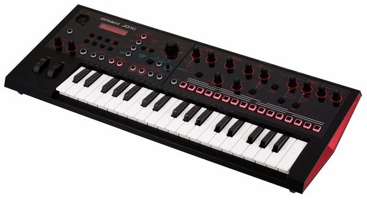
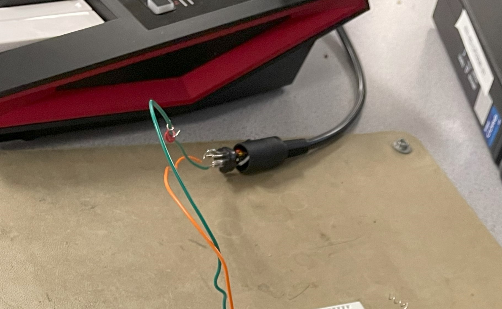
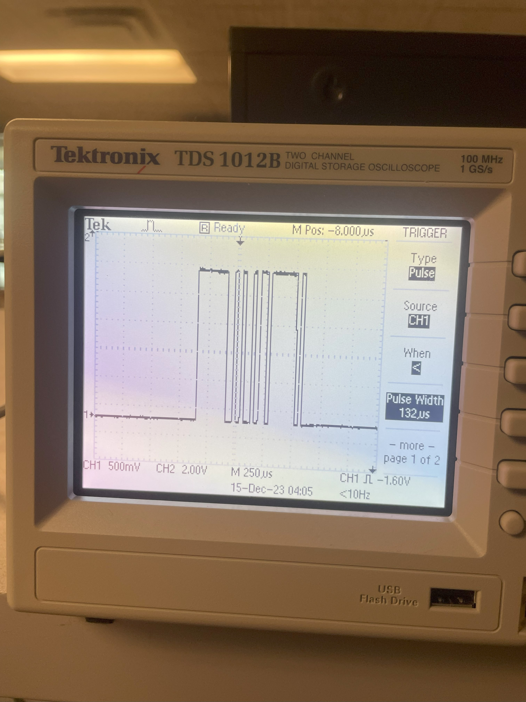

# Welcome to Pelham Bergesen's ECE 4760 final project page!

## Project Introduction

ECE 4760 is a microcontrollers class, so the standard platform we use for all our projects is the Raspberry Pi Pico. We code in C and use different hardware peripherals to make our microcontroller perform different functions, such as emulating birdsong and implementing PID control. For my final project, I drew on a couple functions we had worked on earlier in the year, specifically analog-to-digital conversion, direct digital synthesis, and PWM signal generation.

My project was turning my Raspberry Pi Pico microcontroller into a synthesizer, controlled by a MIDI keyboard output (MIDI is a method of containing and transmitting musical information from controllers to instruments). This MIDI control was inputted into the Pico via a UART channel, where the Pico then read the bytes transmitted in the MIDI message and decoded which frequency to output. This frequency was generated via PWM, so my final output sound was a square wave, resulting in a classic synth sound.

## High Level Design

The source of my project idea was actually my MIDI controller itself, the Roland JD-XI. While I used it only as a MIDI controller for my project, this keyboard has a lot of the functionality I considered implementing for my final project, such as the ability to swap between square, sine, triangle, and sawtooth waves. The JD-XI also has an effects chain, toggleable from the keyboard itself, with potentiometers to determine the amount of effect that is applied to the output sound. A picture of the JD-XI is below.

The background math present in my project mostly relates to the notes on a piano. These are established frequencies, so I didn’t have to do any of these calculations myself, but essentially the notes on my keyboard are divided into the same frequencies as the notes on a standard-tuned piano. These frequencies are based on the note “A” having a fundamental frequency of 440 Hertz, moving up by a factor of 2 for the next higher A note for 880 Hz. The notes in between the octaves of A are then divided between these frequencies according to a logarithmic function and increase by a factor of the square root of twelve. As I mentioned previously, I did not do any of these calculations as these are established frequencies, and I just hard-coded the frequencies for my keys into the program I wrote. 

The structure of the program is pretty simple: my keyboard outputs MIDI, which is read into the Raspberry Pi and then parsed based on the notes’ unique encoding. Then, once the note has been identified, the Pico generates a PWM frequency based on that note.

The issue of latency is pretty prevalent in more musical engineering applications, so I had to ensure that the code parsing the notes would not take too long to execute. Additionally, whatever wave-generation function I used, which would have been more of a concern with DDS, would have to meet timing constraints as well or risk not producing the proper frequency.

As far as I am concerned, my design did not violate any patents or copyrights, but admittedly I was trying to emulate some functions of the previously mentioned JD-XI synthesizer by Roland.

## Program and Hardware Design

The most infuriating part of my program design was decoding the MIDI outputs from my controller. This journey started with strange diagrams from the internet, telling me that I only needed to tap into two of the five prongs on the MIDI cable, as shown in the picture below.

Once I tapped into this cable, I was able to see the signals coming from the MIDI controller. They looked like this when viewing them on the oscilloscope:

I noticed that these signals were too high in voltage to be read by my Pico’s UART interface, so I dropped the signal’s voltage by using two diodes in series. This brought the signal back down to a level that could be safely read by the Pico. I then wrote code that would read the incoming signals via this UART channel and output them to my serial monitor. 

Upon inspecting this output, I determined that the signals I was receiving were reliable and could be used to identify which note was pressed. For example, the signature 3-byte sequence for the lowest C note on my keyboard was (115 59 0), the lowest D was (51 59 0), and the lowest E was (243 59 0). However, if you've noticed the pattern between these three numbers, you're more perceptive than I was at first glance, and you might even be able to guess some of the issues I would later encounter. It appears that the first byte goes up by 32 per note, so moving from C to C# to D, the byte value moves from 115 to 51. This pattern continues as the notes increases, until the value reaches zero, at which point it wraps back up to 256 and continues decreasing. The second byte displays a similar macro-pattern, where in the first octave of notes has a second byte of 59 and the second octave and up has a second byte of 118.

These patterns, however convenient, cause an overlap issue between a multitude of notes on the keyboard. I thought I could find some sort of difference in the way my UART decoded the different note-on signature messages, but it became clear that they were present in amny places across my keyboard. To try and mitigate this damage, I used only the white notes (for the key of C), which avoided overlapping for two octaves until I reached the third C. This note had the same signature pattern as the lower D note, so I stopped here to re-evaluate how my UART was configured.

One possible source of the issue is the way I was routing the MIDI to UART. As you can tell from the oscilloscope picture, the MIDI notes appear to be active low; I later learned, after I had done all my note-decoding, that the UART protocol is active high. This could have led to my signals being corrupt or registered incorrectly, which would line up with the fact that none of the signals appeared to follow standard MIDI protocol, which usually would have a status byte (defining if the signal is a Note On signal, a Note Off signal, or another type of MIDI signal) before any byte containing information about the actual note. However, I'm still skeptical of this conclusion, since it seems to me that even if the highs and lows were reversed, I would not be seeing signals that followed standard MIDI protocol (see [reference 1](appendixb.md)). For whatever reason, my setup was pretty exact, and I can't say if a different MIDI output would produce different results on a UART level, but I would hope that a more reliable transmission method could be identified, given more time and effort.

## Results

## Conclusions

I set my sights high, as this is a highly expandable project idea, and I planned to be able to generate sound via different waveforms, such as square waves and sine waves. If I had time, I would have added some analog effects to the synthesizer output, normalizing for the different voltages required by 1/4 inch and 3 mm headphone jacks.

## Appendices

To [APPENDIX A (Permissions)](appendixa.md)

To [APPENDIX B (References & Sources)](appendixb.md)
